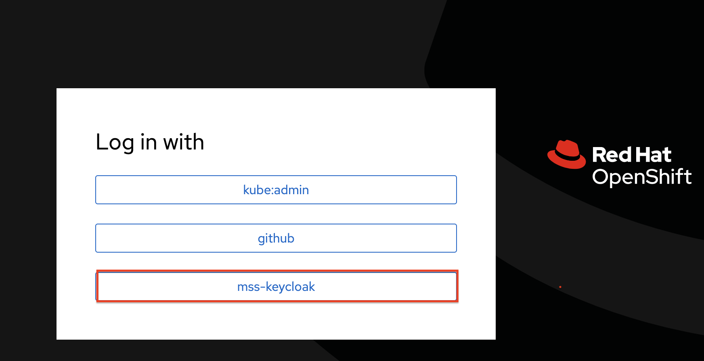
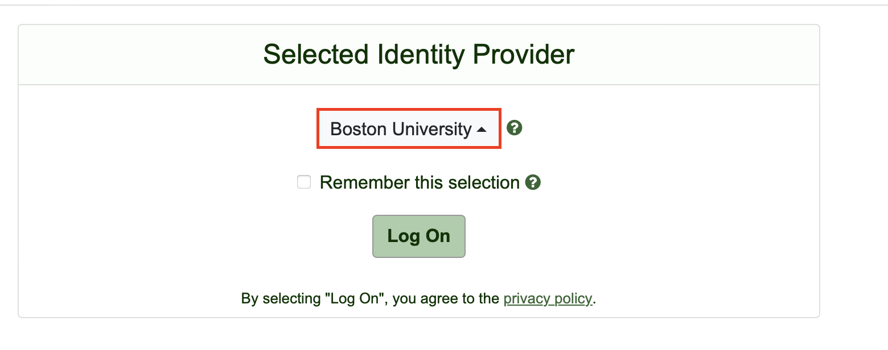
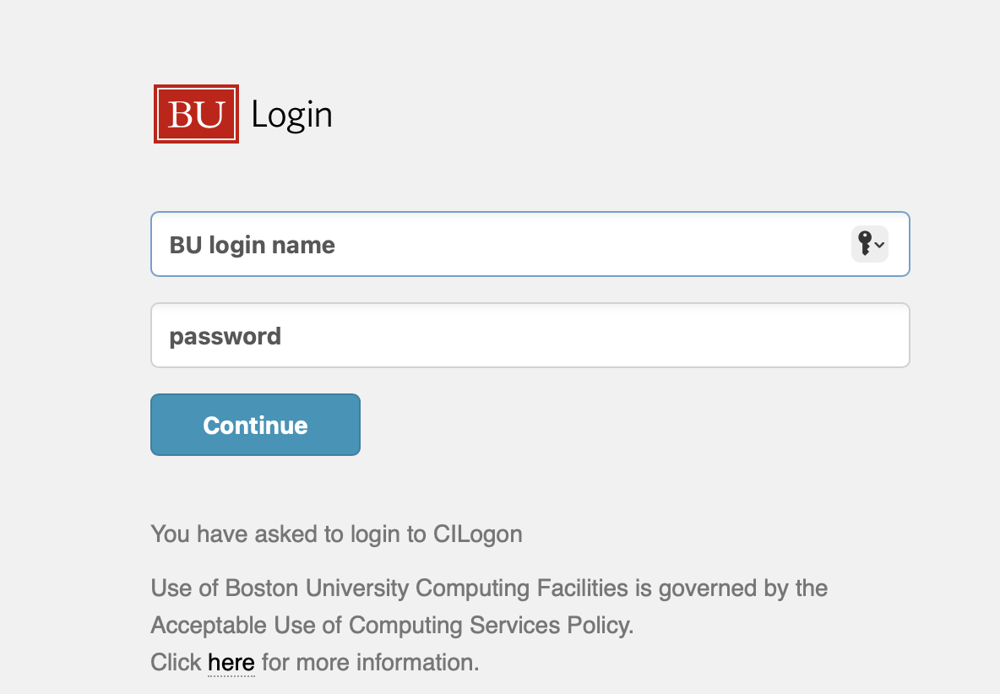
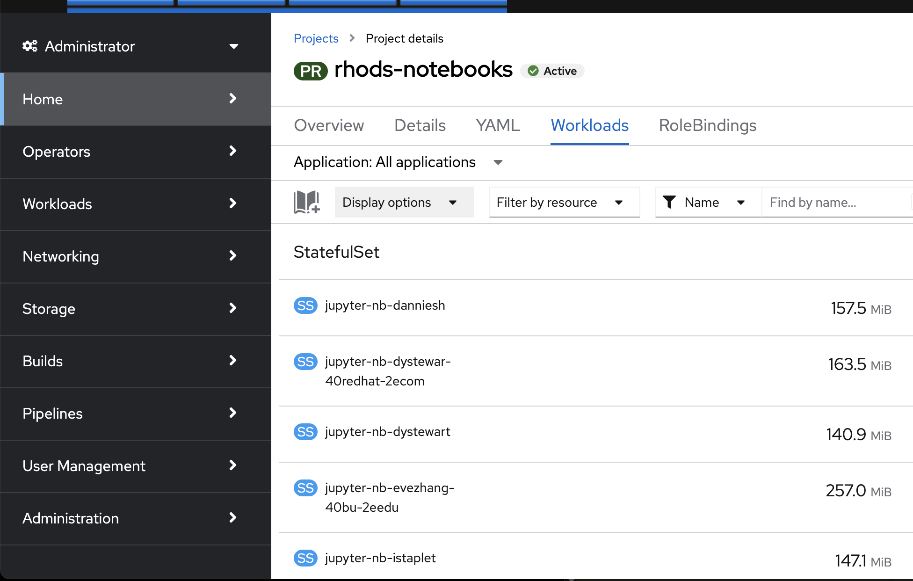
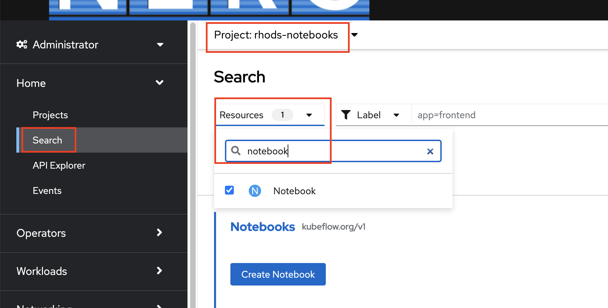
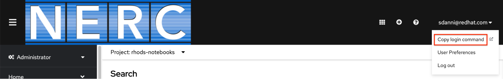

# Getting Access to Openshift Console

## Login

Open this link in a browser:

- <https://console.apps.shift.nerc.mghpcc.org/k8s/cluster/projects/rhods-notebooks>

Select mss-keycloak login option:



You will be redirected to a site managed by CILogon where you will select your institutional or commercial identity provider as shown below (Choose Boston University if you are using your BU ID):



Once selected, you will be redirected to your institutional or commercial identity provider where you will login as shown here:



## Openshift Web Interface

After successful logon, your browser will direct you to NERC Openshift Console rhods-notebooks namespace. Here, you have the ability to view and manage workloads, as well as search for and list notebooks. Please note that the workloads and notebooks displayed include from both cs210 and ee440 classes. It’s important to be aware of this broader scope while managing resources in the namespace.

### View workloads



### Search for notebooks

On the left panel, select ‘Home’ -> ‘Search’, from the ‘Project’ dropdown box, choose ‘rhods-notebooks’, from the ‘Resource’ dropdown box, type ‘notebook’ . Then you can see a list of notebooks:



## Openshift CLI

### CLI Login

Using the OpenShift CLI (Command Line Interface) allows users to manage student resources efficiently.

#### Download Openshift CLI

Follow these instructions to download the CLI tools from: <https://docs.openshift.com/container-platform/4.11/cli_reference/openshift_cli/getting-started-cli.html>

#### Get your login token

On the NERC OCP console:

- From the top right username dropdown box, select “Copy login command”.
- You will be redirected to a new page. Click “Display Token”. 
- Copy the cli command under “Log in with this token”.
- Paste this command in your local terminal to login.



### List notebooks with CLI

```
oc get notebooks -n rhods-notebooks
```

Note, this command displays all notebooks under rhods-notebooks namespace.

### Launch student notebooks

Notebook name is in the format of “`jupyter-nb-<username>`”. A script has been provided for you to retrieve a student jupyter notebook URL. Please refer to this README file: <https://github.com/OCP-on-NERC/BU-RHOAI?tab=readme-ov-file#get_urlpy>
You can open the URL in your browser to view the student notebook.

